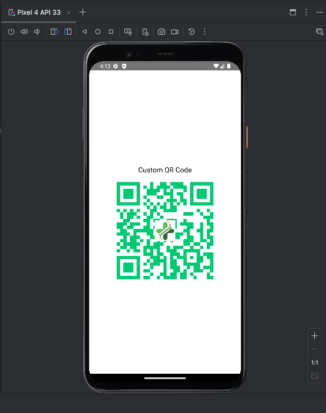

# 📱 Custom QR Code Generator - React Native

This project is a lightweight **React Native** app designed to test and demonstrate **custom QR code generation** using the same library as used in the Medfilo application. It includes customization like color matching and adding logos to the center of the QR code.

---

## 🚀 Features

- Generate scannable QR codes.
- Customize QR code color to match app branding.
- Optionally embed a logo/image in the center of the QR code.
- Built with `react-native-qrcode-svg`.

---

## 🧱 Prerequisites

Make sure the following tools are installed:

- [Node.js](https://nodejs.org/) (v16 or above recommended)
- [React Native CLI](https://reactnative.dev/docs/environment-setup) (`npx react-native`)
- [Android Studio](https://developer.android.com/studio) with Emulator setup
- Xcode (for iOS testing on Mac - optional)
- `yarn` or `npm`

---

## 📦 Installation

1. **Clone the repository (or navigate to QRCodeTest folder):**
   ```bash
   git clone https://github.com/mgulati3/QrCode-color.git
   cd QRCodeTest
   ```

2. **Install dependencies:**
   ```bash
   yarn install
   # OR
   npm install
   ```

3. **Install SVG support (used by QR Code library):**
   ```bash
   yarn add react-native-svg
   yarn add react-native-qrcode-svg
   ```

4. **(Android only) Rebuild native modules:**
   ```bash
   cd android
   ./gradlew clean
   cd ..
   ```

---

## ▶️ Running the App

Start the Metro bundler:

```bash
npx react-native start
```

In a separate terminal, run the app on an Android emulator:

```bash
npx react-native run-android
```

> ℹ️ You can also use `run-ios` if you're on macOS and Xcode is configured.

---

## 🎨 Customize Your QR Code

You can find the QR code logic inside `App.tsx`. Here's how to modify it:

### Change QR Content:
Update the `value` field with any address:
```tsx
value="https://medfilo.app/verify/101"
```

### Change QR Color:
Update the `color` field:
```tsx
color="#28C76F" // Medfilo Green
```

### Add a Logo:
Make sure you have a local logo image (e.g., `assets/logo.png`), then:

```tsx
logo={require('./assets/logo.png')}
logoSize={50}
logoBackgroundColor="transparent"
```

---

## ✅ Output Preview

- A centered, scannable QR code in the app.
- Custom color matching the Medfilo theme.
- Optional logo support.

---

## 📸 Sample Screenshot



---

## 🛠️ Troubleshooting

- If `react-native-svg` error occurs:
  ```bash
  cd android && ./gradlew clean && cd ..
  npx react-native run-android
  ```

- If Metro bundler fails, restart with:
  ```bash
  npx react-native start --reset-cache
  ```

---

## 📄 License

This project is for **internal testing** and demonstration only.

---

## 🧑‍💻 Maintainer

Manan Gulati  
Email: mgulati3@asu.edu
